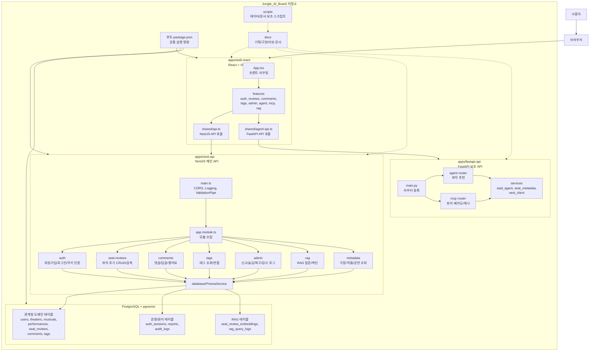

# 프로젝트 구조와 설계 리뷰

이 문서는 `Jungle_AI_Board` 프로젝트를 처음 보는 사람이 전체 구조를 빠르게 이해하고, 경험 있는 개발자가 보더라도 현재 설계의 흐름을 정확히 파악할 수 있도록 정리한 문서다.

프로젝트를 한 줄로 요약하면 다음과 같다.

```text
뮤지컬 좌석 후기를 모으고, 검색하고, 댓글과 태그로 확장하며,
RAG와 Agent를 통해 좌석 선택을 도와주는 AI 게시판 서비스
```

## 1. 전체 구조 한눈에 보기

루트 구조는 크게 `apps`, `docs`, `scripts`, 설정 파일로 나뉜다.

```text
Jungle_AI_Board/
  apps/
    web-react/      # React + Vite 프론트엔드
    nest-api/       # NestJS 메인 백엔드 API
    fastapi-api/    # FastAPI 기반 Agent/MCP 보조 API
  docs/             # 기획, 구현 순서, 개념 리뷰, 설계 문서
  scripts/          # 문서/데이터 보조 스크립트
  docker-compose.yml
  package.json
  README.md
```

전체 구조를 Mermaid로 그리면 다음과 같다.



이 프로젝트는 하나의 저장소 안에 여러 앱을 함께 두는 모노레포에 가깝다. 다만 Turborepo나 pnpm workspace 같은 본격적인 모노레포 도구를 쓰기보다는, 루트 `package.json`에서 각 앱의 명령을 `npm --prefix`로 호출하는 단순한 방식이다.

루트 `package.json`의 핵심 역할은 다음과 같다.

```text
npm run nest:start   -> apps/nest-api 개발 서버 실행
npm run nest:test    -> NestJS 테스트 실행
npm run web:dev      -> React 개발 서버 실행
npm run web:build    -> React 빌드
npm run db:up        -> PostgreSQL 컨테이너 실행
```

초보자 관점에서는 루트가 "전체 프로젝트 리모컨"이고, `apps/*`가 실제 프로그램이라고 보면 된다.

## 2. 각 앱의 책임

### 2.1 React 프론트엔드: `apps/web-react`

프론트엔드는 사용자가 직접 보는 화면을 담당한다.

주요 기술은 다음과 같다.

- React 19
- React Router
- Vite
- TypeScript

주요 구조는 다음과 같다.

```text
apps/web-react/src/
  App.tsx
  main.tsx
  shared/
    api.ts
    agent-api.ts
  features/
    auth/
    reviews/
    comments/
    tags/
    admin/
    agent/
    mcp/
    rag/
```

`App.tsx`는 프론트 라우팅의 중심이다.

```text
/                    -> 후기 게시판
/theaters/:theaterId -> 극장별 후기
/auth                -> 로그인/회원가입
/admin               -> 관리자 페이지, 로그인 필요
/reviews/new         -> 후기 작성, 로그인 필요
/reviews/:id/edit    -> 후기 수정, 로그인 필요
```

`shared/api.ts`는 NestJS API와 통신하는 공통 함수다. 기본 주소는 `VITE_API_BASE_URL`이고, 없으면 `http://localhost:3000`을 쓴다.

중요한 점은 모든 요청에 `credentials: "include"`가 들어간다는 것이다. 이 프로젝트는 로그인 토큰을 httpOnly cookie로 주고받기 때문에 브라우저가 쿠키를 포함해서 요청해야 한다.

`shared/agent-api.ts`는 FastAPI 보조 서버와 통신한다. 기본 주소는 `VITE_AGENT_API_BASE_URL`이고, 없으면 `http://localhost:8000`이다.

프론트의 설계 특징은 "기능 단위 분리"다.

```text
features/auth      -> 인증 화면과 인증 API
features/reviews   -> 후기 목록, 작성, 좌석 지도, 필터
features/comments  -> 댓글 조회/작성/수정/삭제/좋아요
features/tags      -> 태그 선택과 태그 API
features/admin     -> 신고 처리, 숨김/복구/강제 삭제, 감사 로그
features/agent     -> 좌석 추천 Agent 호출
features/mcp       -> MCP 좌석 배치도 호출
features/rag       -> RAG 관련 타입/API
```

이 구조는 화면이 커질수록 유리하다. 예를 들어 댓글 기능을 고칠 때 `features/comments`부터 보면 되고, 관리자 기능은 `features/admin` 안에서 출발하면 된다.

### 2.2 NestJS 메인 API: `apps/nest-api`

NestJS 백엔드는 이 서비스의 중심이다. 사용자, 후기, 댓글, 태그, 관리자, RAG 저장/검색 같은 핵심 도메인을 담당한다.

주요 기술은 다음과 같다.

- NestJS
- Prisma
- PostgreSQL
- pgvector
- Jest
- cookie 기반 인증

주요 구조는 다음과 같다.

```text
apps/nest-api/src/
  main.ts
  app.module.ts
  admin/
  auth/
  comments/
  common/
  database/
  health/
  metadata/
  rag/
  seat-reviews/
  tags/
  users/
```

`main.ts`는 서버 부팅 지점이다.

여기서 설정하는 중요한 전역 정책은 다음과 같다.

- CORS 허용 정책
- request logging middleware
- ValidationPipe
- 서버 포트

```text
HTTP 요청
  -> CORS 검사
  -> request logging middleware
  -> Guard
  -> ValidationPipe
  -> Controller
  -> Service
  -> PrismaService
  -> PostgreSQL
```

`app.module.ts`는 Nest 모듈을 조립하는 중심이다.

```text
DatabaseModule
AdminModule
HealthModule
AuthModule
MetadataModule
SeatReviewsModule
CommentsModule
TagsModule
RagModule
```

NestJS 앱에서는 보통 다음 단위가 함께 움직인다.

```text
Module      -> 기능 묶음
Controller  -> HTTP 요청을 받는 입구
Service     -> 실제 비즈니스 로직
DTO         -> 요청값 검증 규칙
Guard       -> 인증/권한 검사
```

예를 들어 좌석 후기 기능은 다음처럼 구성된다.

```text
seat-reviews/
  seat-reviews.module.ts
  seat-reviews.controller.ts
  seat-reviews.service.ts
  dto/
    create-seat-review.dto.ts
    update-seat-review.dto.ts
    seat-review-query.dto.ts
```

Controller는 "어떤 URL을 받을지"를 알고, Service는 "그 요청을 어떻게 처리할지"를 안다. 이 분리가 유지보수의 핵심이다.

### 2.3 FastAPI 보조 API: `apps/fastapi-api`

FastAPI 서버는 메인 백엔드라기보다 AI/Agent/MCP 성격의 보조 서버다.

주요 구조는 다음과 같다.

```text
apps/fastapi-api/app/
  main.py
  routers/
    agent.py
    demo.py
    mcp.py
  schemas/
  services/
    nest_client.py
    seat_agent_service.py
    seat_metadata_service.py
    message_service.py
```

현재 담당 기능은 다음과 같다.

- 좌석 추천 Agent: `POST /agent/seat-recommendations`
- MCP 좌석 배치도 조회: `GET /mcp/seat-layouts/{theater_name}`
- MCP cache refresh: `POST /mcp/cache/refresh`

FastAPI는 NestJS와 다른 일을 맡는다. NestJS가 "서비스의 공식 데이터와 API"를 책임진다면, FastAPI는 "좌석 추천, 외부 좌석 메타데이터, Agent 성격의 보조 로직"을 담당한다.

이 분리는 AI나 Agent 기능을 메인 API와 독립적으로 다룰 수 있게 해준다. NestJS는 서비스의 핵심 데이터와 규칙을 담당하고, FastAPI는 좌석 추천과 외부 좌석 메타데이터 같은 보조 흐름을 담당한다.

## 3. 데이터베이스 설계

데이터베이스는 PostgreSQL이고, `docker-compose.yml`에서 `pgvector/pgvector:pg16` 이미지를 사용한다.

즉 일반 관계형 데이터뿐 아니라 RAG용 vector embedding도 저장할 수 있다.

Prisma schema의 핵심 모델은 다음과 같다.

```text
User
  -> SeatReview
  -> Comment
  -> AuthSession
  -> PasswordResetToken
  -> CommentLike

Theater
  -> Performance
  -> SeatReview

Musical
  -> Performance
  -> SeatReview

Performance
  -> Theater + Musical의 특정 시즌/공연 조합

SeatReview
  -> User, Theater, Musical, Performance
  -> Comment
  -> Tag
  -> SeatReviewEmbedding

Comment
  -> SeatReview
  -> User
  -> parent Comment
  -> CommentLike

Tag
  -> SeatReviewTag

ReviewReport / CommentReport
  -> 신고 데이터

AuditLog
  -> 관리자 액션 기록

SeatReviewEmbedding
  -> RAG 검색용 문서와 vector

RagQueryLog
  -> RAG 질문 로그
```

초보자 관점에서 가장 중요한 중심축은 다음이다.

```text
사용자(User)
  -> 좌석 후기(SeatReview)
    -> 댓글(Comment)
    -> 태그(Tag)
    -> 신고(ReviewReport)
    -> RAG 임베딩(SeatReviewEmbedding)
```

전문가 관점에서 볼 만한 설계 포인트는 다음이다.

- `SeatReview`가 극장, 작품, 공연, 좌석 위치, 평점, 본문을 모두 가진 핵심 aggregate 역할을 한다.
- `Performance`는 `Musical + Theater + seasonLabel` 조합으로 공연 시즌을 표현한다.
- `SeatReviewTag`로 후기와 태그를 다대다 관계로 연결한다.
- 댓글은 `parentId`를 통해 답글 구조를 지원한다.
- 댓글 좋아요는 `CommentLike`에서 `commentId + userId` unique 제약으로 중복 좋아요를 막는다.
- 관리자 moderation은 `moderationStatus`, `hiddenAt`, `deletedAt` 같은 필드로 공개 상태와 삭제 상태를 구분한다.
- refresh token은 원문이 아니라 hash를 `AuthSession`에 저장한다.
- RAG용 embedding은 `SeatReviewEmbedding`에 별도 저장해 후기 원본과 검색 벡터를 분리한다.

## 4. 주요 요청 흐름

### 4.1 로그인 흐름

```text
React 로그인 폼
  -> POST /auth/login
  -> AuthController
  -> LoginRateLimitGuard
  -> AuthService
  -> User 조회 및 비밀번호 검증
  -> access token cookie 설정
  -> refresh token cookie 설정
  -> user 정보 반환
```

이 프로젝트는 로그인 응답 body에 토큰을 직접 내려주지 않는다. 대신 httpOnly cookie를 설정한다.

- JavaScript에서 토큰을 직접 읽기 어렵다.
- localStorage 토큰 방식보다 XSS 피해를 줄일 수 있다.
- 프론트는 `credentials: "include"`만 일관되게 쓰면 된다.

### 4.2 후기 목록 조회 흐름

```text
ReviewBoardPage
  -> features/reviews/api.ts
  -> GET /seat-reviews 또는 /seat-reviews/search
  -> SeatReviewsController.findAll()
  -> SeatReviewsService.findAll()
  -> Prisma seatReview.findMany()
  -> items, total, page, limit, hasNext 반환
```

후기 목록은 공개 API다. 로그인하지 않아도 조회할 수 있다.

현재 `GET /seat-reviews`와 `GET /seat-reviews/search`는 둘 다 `findAll(query)`로 연결된다.

### 4.3 후기 작성 흐름

```text
ReviewCreatePage
  -> POST /seat-reviews
  -> JwtAuthGuard
  -> CreateSeatReviewDto Validation
  -> SeatReviewsService.create()
  -> theater/musical/performance 검증
  -> SeatReview 생성
  -> 태그 연결
  -> RAG embedding 갱신 트리거
  -> public response 반환
```

여기서 중요한 설계는 DTO와 Guard다.

- `JwtAuthGuard`: 로그인한 사용자만 작성 가능하게 한다.
- `CreateSeatReviewDto`: 좌석 위치, 평점, 본문 같은 입력값을 검증한다.
- Service: 검증된 입력값을 실제 도메인 데이터로 저장한다.

초보자에게는 "Guard는 문 앞에서 신분증을 확인하고, DTO는 신청서 양식이 맞는지 확인한다"고 이해하면 쉽다.

### 4.4 댓글과 좋아요 흐름

```text
GET    /seat-reviews/:reviewId/comments
POST   /seat-reviews/:reviewId/comments
PATCH  /comments/:id
DELETE /comments/:id
POST   /comments/:id/like
DELETE /comments/:id/like
```

댓글 조회는 공개이고, 댓글 작성/수정/삭제/좋아요는 로그인 필요다.

댓글은 `parentId`가 있어 답글을 표현할 수 있다. 좋아요는 `CommentLike` 테이블에서 사용자별 중복을 막는다.

### 4.5 관리자 moderation 흐름

관리자 기능은 `AdminModule`이 담당한다.

```text
관리자 페이지
  -> /admin/*
  -> JwtAuthGuard
  -> AdminGuard
  -> AdminService
  -> 신고/숨김/복구/강제삭제/감사로그 처리
```

관리자 기능은 일반 삭제와 moderation 처리를 구분한다.

```text
일반 삭제     -> 작성자가 자기 글을 삭제
숨김          -> 관리자가 공개 목록에서 제외
복구          -> 관리자가 다시 공개
강제 삭제     -> 관리자가 실제 삭제
감사 로그     -> 관리자 액션 기록
```

이 구분은 운영 서비스에서 중요하다. 신고된 콘텐츠를 바로 지워버리면 증거와 맥락이 사라질 수 있고, 반대로 숨김/복구/로그를 남기면 운영 판단을 추적할 수 있다.

### 4.6 RAG 흐름

RAG는 기존 좌석 후기를 근거로 자연어 질문에 답하기 위한 기능이다.

현재 NestJS에는 다음 endpoint가 있다.

```text
POST /rag/questions
POST /rag/index/:reviewId
POST /rag/index
```

데이터 흐름은 대략 다음과 같다.

```text
SeatReview
  -> rag-document.builder
  -> 문서 문자열 + metadata 생성
  -> OpenAI embedding 생성
  -> SeatReviewEmbedding 저장
  -> 질문 시 vector 검색
  -> 관련 후기 기반 답변 생성
  -> RagQueryLog 기록
```

RAG 설계는 원본 후기와 임베딩 저장소를 분리한다.

```text
seat_reviews             -> 서비스 원본 데이터
seat_review_embeddings   -> 검색 최적화 데이터
rag_query_logs           -> 질문/응답 품질 관찰 데이터
```

이렇게 나누면 임베딩 문서 버전을 바꾸거나 재색인하더라도 원본 후기 데이터 모델을 크게 흔들지 않는다.

### 4.7 Agent/MCP 흐름

FastAPI는 Agent와 MCP 보조 기능을 담당한다.

```text
React features/agent
  -> shared/agent-api.ts
  -> POST http://localhost:8000/agent/seat-recommendations
  -> FastAPI agent router
  -> seat_agent_service
  -> 좌석 추천 응답
```

```text
React features/mcp
  -> shared/agent-api.ts
  -> GET http://localhost:8000/mcp/seat-layouts/{theater_name}
  -> FastAPI mcp router
  -> seat_metadata_service
  -> 좌석 배치도 응답
```

이 구조는 "핵심 서비스 API는 NestJS, 실험적 AI/메타데이터 기능은 FastAPI"라는 책임 분리를 만든다.

## 5. 설계 원칙 평가

### 5.1 관심사 분리

현재 구조는 관심사 분리가 비교적 잘 되어 있다.

```text
프론트 화면       -> apps/web-react
핵심 API          -> apps/nest-api
AI/Agent/MCP      -> apps/fastapi-api
DB 모델           -> apps/nest-api/prisma/schema.prisma
기획/리뷰 문서     -> docs
```

NestJS 내부에서도 Controller, Service, DTO, Guard, Module이 나뉘어 있다.

특히 `SeatReviewsService`는 후기 CRUD, 검색, 권한, 태그, RAG 트리거를 연결하는 중심 서비스다. Controller가 요청 입구를 맡고, Service가 실제 도메인 흐름을 담당하는 전형적인 NestJS 구조를 따른다.

### 5.2 도메인 중심 설계

프로젝트는 기술보다 도메인 중심으로 잘 잡혀 있다.

핵심 도메인은 다음이다.

```text
사용자
극장
작품
공연
좌석 후기
댓글
태그
신고/관리
RAG 문서
좌석 추천 Agent
```

파일 구조도 이 도메인 이름을 따라간다. 기능을 찾을 때 기술 이름보다 서비스 개념으로 이동할 수 있다.

### 5.3 API 설계

현재 API는 REST 중심이다.

- 리소스 이름이 대체로 명확하다.
- 조회는 `GET`, 생성은 `POST`, 수정은 `PATCH`, 삭제는 `DELETE`를 쓴다.
- 공개 API와 인증 API가 구분되어 있다.
- 관리자 API가 `/admin` 아래로 모여 있다.
- 목록 응답에 pagination 정보가 있다.

### 5.4 보안 설계

- access/refresh token을 httpOnly cookie로 관리한다.
- refresh token 원문 대신 hash를 저장한다.
- 로그인 실패 메시지를 통일한다.
- 로그인 rate limit이 있다.
- DTO validation에서 알 수 없는 필드를 거절한다.
- 관리자 기능은 별도 `AdminGuard`를 거친다.
- CORS는 credentialed request를 허용하되 origin allowlist를 쓴다.

### 5.5 테스트 설계

NestJS는 Jest를 사용한다.

현재 테스트는 인증, 쿠키, CORS, request logging, 댓글, 관리자, RAG parser, 후기 서비스, 태그 서비스 등 중요한 지점에 분포해 있다.

프론트는 별도 테스트 프레임워크보다는 Node의 `--experimental-strip-types`로 TypeScript 테스트 파일을 직접 실행하는 구조다. 검색 쿼리 생성, 필터, API path 생성 같은 순수 로직 테스트에 적합하다.

FastAPI는 Python `unittest` 스타일 테스트가 있다.

## 6. 초보자를 위한 코드 읽는 순서

처음 이 프로젝트를 읽는다면 다음 순서로 보면 된다.

1. `docs/project_plan.md`

   서비스가 무엇을 만들려는지 먼저 이해한다.

2. `README.md`

   전체 앱 구성과 실행 방법을 확인한다.

3. `apps/web-react/src/App.tsx`

   사용자가 볼 수 있는 페이지와 라우팅을 확인한다.

4. `apps/web-react/src/shared/api.ts`

   프론트가 NestJS API를 어떻게 호출하는지 확인한다.

5. `apps/nest-api/src/app.module.ts`

   백엔드에 어떤 기능 모듈이 있는지 확인한다.

6. `apps/nest-api/src/main.ts`

   CORS, logging, validation 같은 전역 정책을 확인한다.

7. `apps/nest-api/prisma/schema.prisma`

   실제 데이터 구조를 확인한다.

8. `apps/nest-api/src/seat-reviews/seat-reviews.controller.ts`

   핵심 도메인인 좌석 후기 API 입구를 확인한다.

9. `apps/nest-api/src/seat-reviews/seat-reviews.service.ts`

   후기 생성/검색/수정/삭제 로직을 확인한다.

10. `apps/fastapi-api/app/main.py`

    Agent/MCP 보조 서버가 어떤 router를 붙이는지 확인한다.

## 7. 전문가를 위한 설계 관찰 포인트

아키텍처를 더 깊게 볼 때는 다음 현재 구조를 중심으로 보면 된다.

- NestJS와 FastAPI가 역할별로 분리되어 있다.
- NestJS는 도메인 API와 데이터 영속성을 담당한다.
- FastAPI는 Agent와 MCP 같은 보조 기능을 담당한다.
- API 응답은 Controller와 Service에서 도메인별로 조립된다.
- Prisma schema가 데이터 모델의 기준점이다.
- 관리자 moderation은 숨김, 복구, 강제 삭제, 감사 로그를 구분한다.
- RAG embedding은 원본 후기와 별도 테이블에 저장된다.
- `documentVersion`으로 RAG 문서 포맷 버전을 표시한다.
- 인증은 access cookie와 refresh cookie를 분리한다.
- 프론트는 기능 단위 디렉터리와 API 래퍼를 함께 둔다.

## 8. 현재 구조의 장점

현재 프로젝트의 장점은 다음과 같다.

- 서비스 목표와 코드 구조가 잘 맞는다.
- 프론트, 메인 백엔드, AI 보조 백엔드의 책임이 분리되어 있다.
- NestJS는 모듈/컨트롤러/서비스/DTO/가드 구조를 잘 따른다.
- Prisma schema가 도메인의 핵심 관계를 명확히 표현한다.
- 후기, 댓글, 태그, 신고, 관리자, RAG까지 확장 가능한 기반이 있다.
- 인증이 httpOnly cookie 기반이다.
- RAG embedding을 별도 테이블로 분리한다.
- 문서가 `docs` 아래에 단계별로 잘 축적되어 있다.

## 9. 전체 설계 요약

이 프로젝트는 단순 게시판이 아니라 좌석 경험 데이터를 구조화하고, 그 데이터를 AI 기능의 근거로 확장하는 서비스다.

```text
React
  -> 사용자 화면과 상호작용

NestJS
  -> 사용자, 인증, 후기, 댓글, 태그, 관리자, RAG 메인 API

PostgreSQL + pgvector
  -> 관계형 도메인 데이터와 RAG embedding 저장

FastAPI
  -> Agent 좌석 추천과 MCP 좌석 메타데이터 보조 API

docs
  -> 기획, 구현 순서, 개념 리뷰, 품질 평가 기록
```

현재 설계는 좌석 후기라는 도메인을 중심에 두고, 게시판 기능과 AI 보조 기능을 분리해서 구성한다. 사용자는 React 화면을 통해 후기를 탐색하고 작성하며, NestJS는 핵심 데이터와 API를 처리하고, FastAPI는 좌석 추천과 MCP 좌석 메타데이터를 보조한다.
